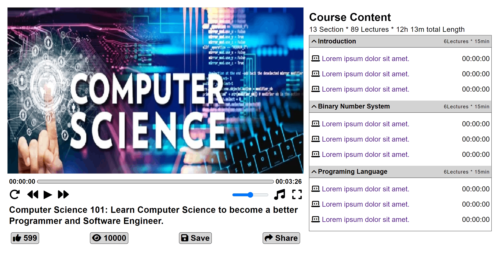

  <h2 align="center">ELearn - Online Education Platform.</h2>

  ELearn is a fully responsive Online Education PLatform,  Responsive for all devices, build using HTML, CSS, and JavaScript.

  <a href="https://subirkumarpratihar.github.io/ELearn/"><strong>➥ Live Demo</strong></a>

 

### Demo Screeshots

 

### Contact📞

If you want to contact with me, you can reach me at [Linkedin](https://www.linkedin.com/in/subirkumarpratihar/).

### Hire Me 🧑🏻‍💼

If you want to create a Responsive Website for your business growth, You can reach me at [🔗](https://subirkumarpratihar.github.io/subirKumar/) or [Upwork](https://www.upwork.com/freelancers/~018217ee6c19c3fd98) .

